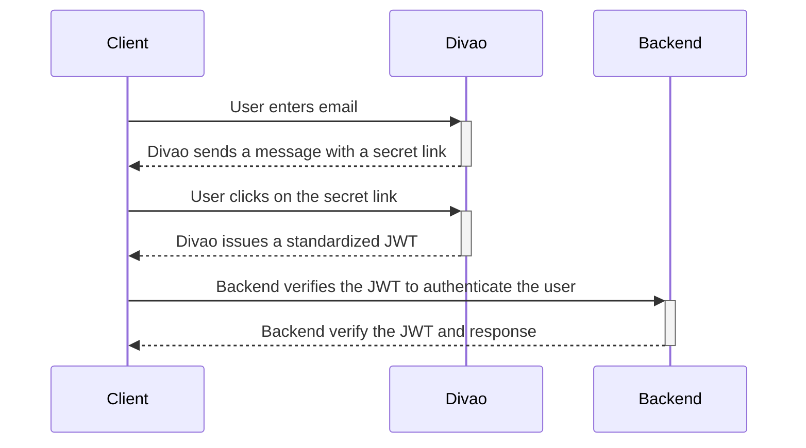

# Divao Passwordless

Divao Passwordless Sign-On allows you to sign-up and sign-in users without any passwords.

Divao verifies the email or phone number provided, and returns with a [JSON Web Token (JWT)](https://en.wikipedia.org/wiki/JSON_Web_Token) signed by Divao used to authenticates a user.

## How Does it work?

Divao Passworldess verifies a user's digital identity (e.g. email address, phone number).

1. User enters the digital identity (e.g. `john@example.org`)
1. Divao sends a message with a secret link (e.g. `https://divao.io/x2IOrGDkLNVZsDYptNXaAg`)
1. User clicks on the secret link, thereby proving that they own that digital identity
1. Divao issues a standardized [JSON Web Token (JWT)](https://en.wikipedia.org/wiki/JSON_Web_Token)




## Getting started

### How to add Divao Passwordless to your web app

With these four simple steps you can add Divao Passwordless to your web app.

#### 1. Include JavaScript

Inlcude the Divao library by adding the following line of code to your website:

```html
<script async data-api-key="YOUR_DIVAO_API_KEY" src="https://api.divao.io/v1/"></script>
```

#### 2. Show sign dialog

Show the Divao sign dialog:

```html
<button onclick="Divao.sign()">Sign without password</button>
```

#### 3. React to the sign-in

Retrieve the token:

```js
window.addEventListener("DivaoSignOn", () =>
{
    if(Divao.JWT !== null)
    {
        console.log(Divao.JWT.payload.sub); //e.g. alice@example.org
        console.log(Divao.JWT.toString()) //e.g. eyJhbGciO...
        const header = `Bearer ${Divao.JWT}`;    
        //use to call backend API
    }
    else
    {
        console.log("not signed in");
    }
});
```

Here it is a working example:

```html
<!DOCTYPE html>
<html>
<head>
    <meta charset="UTF-8">
    <meta name="viewport" content="width=device-width, initial-scale=1.0">
    <title>Passwordless sign-on Sample</title>
    <link rel="stylesheet" href="https://cdn.jsdelivr.net/npm/bootstrap@4.5.3/dist/css/bootstrap.min.css"
        integrity="sha384-TX8t27EcRE3e/ihU7zmQxVncDAy5uIKz4rEkgIXeMed4M0jlfIDPvg6uqKI2xXr2" crossorigin="anonymous">
</head>
<body>
    <script async data-api-key="xHm3vEuUVITNWRTsbZpn8l" src="https://api.divao.io/v1/"></script>
    <div class="container-fluid">
        <div>
            <span></span>
        </div>
        <div>
            <button class="btn btn-primary" onclick="Divao.sign()" style="display: none;">Sign on</button>
            <button class="btn btn-danger" style="" onclick="Divao.signout()">Sign out</button>
        </div>
    </div>
    <script>
        window.addEventListener("DivaoSignOn", () => {
            document.querySelector("span").textContent = Divao.JWT === null ? "You have not sign up yet." : `Welcome ${Divao.JWT.payload.sub}`;
            document.querySelector("button[class ~= btn-primary]").style.display = Divao.JWT === null ? "" : "none";
            document.querySelector("button[class ~= btn-danger]").style.display = Divao.JWT === null ? "none" : "";
        });
    </script>
</body>
</html>
```

#### 4. Verify token

Verify the token on your backend:

```js
import {JWT} from "jose";

const payload = JWT.verify(jwt, DIVAO_PUBLIC_KEY, {aud: "acme.example.com"});
if(payload !== null)
{
    //user is logged in
    console.log(payload.sub); //e.g. john@example.org
}
```

## Configurations

### Register to Divao

To use Divao Passwordless Sign-on, you need to register on  [Divao](https://divao.io/dashboard.html) and acquire the API key.

Once you acquired the API key, you can use it when including the Divao library:

```html
<script async data-api-key="YOUR_DIVAO_API_KEY" src="https://api.divao.io/v1/"></script>
```

NOTE: Please be noticed that API key is bounded by the domain audience (attritribute `aud` specified on token signed by Divao), please ensure the token used on web app is operating on the domain registered that on Divao.

### Obtain the public key of Divao

To verify the JWT, you can use the public key of Divao as below ([JSON Web Key](https://tools.ietf.org/html/rfc7517) format):

```json
{
    "crv": "Ed25519",
    "kid": "c0ffb06ee03497bbb0103db9f53a3956",
    "kty": "OKP",
    "use": "sig",
    "x": "FitlK9tHFHoY5NM_d2XQIya1XZkNvgY-sd6uNGmA4Rw"
}
```